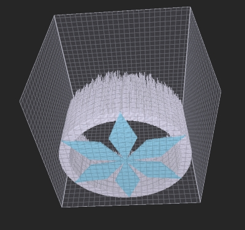

## 1.简介

MagicaCircle，“魔法阵”着色器。开发灵感来自于原神中神里凌华的E技能。

由于是我编写的第一个着色器，能力有限还请见谅。如果您在使用过程中有改进建议，欢迎点击顶栏“关于”按钮与我交流。

<!-- more -->


  本着色器只在MagicaVoxel_0.99.6.3版本中测试过，在较早版本上可能会出现没有参数面板的错误，更新版本理论可以正常运行。


首先给出MagicaCircle的源代码：

```glsl
// xs_begin
// author : '北溟42（beiming42）'    blog：https://beiming42.gitee.io/
// arg : { var = 'Weight' name = 'Weight' value = '0.20' range = '0.10 0.30' step = '0.05' precision = '2' }
// arg : { var = 'Width' name = 'Width' value = '0.81' range = '0.00 1.00' step = '0.01' precision = '2' }
// arg : { var = 'ScaleWall' name = 'ScaleW' value = '0.64' range = '0.00 1.00' step = '0.01' precision = '2' }
// arg : { var = 'ScaleEnergy' name = 'ScaleE' value = '0.01' range = '0.01 100.00' step = '0.01' precision = '2' }
// arg : { var = 'Seed1' name = 'Seed1' value = '56.2' range = '1.0 100.0' step = '1.3' precision = '1' }
// arg : { var = 'Seed2' name = 'Seed2' value = '25.1' range = '1.0 100.0' step = '0.8' precision = '1' }
// arg : { var = 'ColorA' name = 'ColorA' value = '1' range = '1 255' step = '1' precision = '0' }
// arg : { var = 'ColorB' name = 'ColorB' value = '2' range = '1 255' step = '1' precision = '0' }
// arg : { var = 'ColorC' name = 'ColorC' value = '3' range = '1 255' step = '1' precision = '0' }
// xs_end


float random (vec2 st) {
    return fract(sin(dot(st.xy, vec2(12.9898,78.233)))* 43758.5453123);
}

int IfIn(int OX, int OY, int MiddleX, int MiddleY, int R){
    
    float x = abs( float(OX) - 0.5*float(R) );
    float y = abs( float(OY) );

    if( y <= (-2.0*Weight*x+Weight*float(R)) ) return 1;
    return 0;
}

int IfInEnergy(int X, int Y, int Z, int MiddleX, int MiddleY, int R){
    float Rand1 = random( vec2( random(vec2(float(X), float(Z))) , random(vec2(float(Y), float(Z))) ) );
    if( Rand1 <= ScaleEnergy/100.0 ) return 1;
    return 0;
}

int IfInFigure(int X, int Y, int Z, int MiddleX, int MiddleY, int R){
    int OX = X-MiddleX;
    int OY = Y-MiddleY;
    float x,y;

    if(Z==1 || Z==2){
        if( IfIn(OX,OY,MiddleX,MiddleY,R) == 1 ) return 1;

        x= 0.5*float(OX) - 0.86602*float(OY); y=0.86602*float(OX) + 0.5*float(OY); 
        if( IfIn(int(x),int(y),MiddleX,MiddleY,R) == 1 ) return 1;

        x= -0.5*float(OX) - 0.86602*float(OY); y=0.86602*float(OX) - 0.5*float(OY); 
        if( IfIn(int(x),int(y),MiddleX,MiddleY,R) == 1 ) return 1;

        x= -1.0*float(OX) ; y= -1.0*float(OY); 
        if( IfIn(int(x),int(y),MiddleX,MiddleY,R) == 1 ) return 1;

        x= -0.5*float(OX) + 0.86602*float(OY); y= -0.86602*float(OX) - 0.5*float(OY); 
        if( IfIn(int(x),int(y),MiddleX,MiddleY,R) == 1 ) return 1;

        x= 0.5*float(OX) + 0.86602*float(OY); y= -0.86602*float(OX) + 0.5*float(OY); 
        if( IfIn(int(x),int(y),MiddleX,MiddleY,R) == 1 ) return 1;
    }

    return 0;
}

int IfInAirWall(int X, int Y, int Z, int MiddleX, int MiddleY, int R){
    int OX = X-MiddleX;
    int OY = Y-MiddleY;
    float h = int( random(vec2(float(X), float(Y))) * float(R) );
    float Rand2 = random(vec2( random(vec2( float(X),Seed1 )),random(vec2( float(Y),Seed2 )) ));

    if( Rand2 <= ScaleWall && float(OX*OX+OY*OY)>=Width*float(R)*float(R) && (OX*OX+OY*OY)<=R*R && Z<=h && IfInEnergy(X,Y,Z,MiddleX,MiddleY,R) == 1 ) return 2;
    if( Rand2 <= ScaleWall && float(OX*OX+OY*OY)>=Width*float(R)*float(R) && (OX*OX+OY*OY)<=R*R && Z<=h ) return 1;
     
    return 0;
}

float map(vec3 v){
    int X=int(v.x)+1 , Y=int(v.y)+1 , Z=int(v.z)+1;
    int MiddleX = int(i_volume_size.x/2.0) , MiddleY = int(i_volume_size.y/2.0);
    int R = int(i_volume_size.x*0.4);

    if( IfInFigure(X,Y,Z,MiddleX,MiddleY,R) == 1 ) return ColorA;
    if( IfInAirWall(X,Y,Z,MiddleX,MiddleY,R) == 1 ) return ColorB;;
    if( IfInAirWall(X,Y,Z,MiddleX,MiddleY,R) == 2 ) return ColorC;;

    return 0.0;
}
```


  MagicaCircle着色器主要采用三个函数来绘制魔法阵的三要素，分别是**图案、空气墙、能量（杂质）**。

1. **图案**：即魔法阵底部呈现的图案。图案被限制在一个以建模空间中心点为圆心(O)、建模空间边长的0.4倍为半径(R)的圆形中。
2. **空气墙**：魔法阵上方的光芒。空气墙高度与R值相同。空气墙的宽度：从模型顶部向下看，空气墙范围限制在以O为圆心，半径为R的圆与半径为r（0<= r <= R）的圆之间的圆环中，圆环的宽度即为空气墙的宽度。空气墙中体素的绘制【能量（或称“杂质”）是空气墙的一部分】使用体素的X、Y坐标进行计算，因此以相同X、Y值为坐标的、沿Z轴方向排列的一整列体素状态相同，要么这一整列没有体素，要么有体素（空气墙体素或能量体素）。
3. **能量**（或称“杂质”）：原本设计为呈现魔法阵（体积为πR\*R \* R的圆柱体）中流动的能量，可惜因为~~能力有限~~技术限制只能实现为空气墙范围内一个个单独的体素，仿佛杂质一般QAQ，所以叫它杂质……也行吧。


## 2.使用方法

打开MagicaVoxel后，先将建模空间大小设置为较大值，比如256\*256\*256。

然后在**shader（程序）面板**中选择MagicaCircle，可以看到参数栏出现了9个参数。如下表格所示：

| 参数名称 | 默认值 |  取值范围   | 步进值 | 允许小数位数 |                                                                                                    功能解释                                                                                                    |
| :------: | :----: | :---------: | :----: | :----------: | :------------------------------------------------------------------------------------------------------------------------------------------------------------------------------------------------------------: |
|  Weight  |  0.20  |  0.10-0.30  |  0.05  |      2       |                            代表MagicaCircle底部图形的权重。底部图形默认为雪花状图案，本质是一个菱形旋转5次获得的图案。Weight值越大，菱形的短对角线越长，最后底部图案越接近六芒星。                             |
|  Width   |  0.81  |  0.00-1.00  |  0.01  |      2       |                                                                                                  空气墙宽度。                                                                                                  |
|  ScaleW  |  0.64  |  0.00-1.00  |  0.01  |      2       |                                                                                   空气墙的出现比率。数值越小，出现数量越少。                                                                                   |
|  ScaleE  |  0.01  | 0.01-100.00 |  0.01  |      2       | 能量（或称“杂质”）的出现比率。数值越小，出现数量越少。此值在着色器内部还会再除以100以让最终概率局限在0.0001-1.0中。 **注意：即使此值为0.00，杂质仍然会出现！想要不出现杂质可以把ColorC的值设置为ColorB的值。** |
|  Seed1   |  56.2  |  1.0-100.0  |  1.3   |      1       |                                                                     用于生成随机数的种子，Seed1与Seed2组合生成的随机数会与ScaleW进行比较。                                                                     |
|  Seed2   |  25.1  |  1.0-100.0  |  0.8   |      1       |                                                                     用于生成随机数的种子，Seed1与Seed2组合生成的随机数会与ScaleW进行比较。                                                                     |
|  ColorA  |   1    |    1-255    |   1    |      0       |                                                                                                  图案的颜色。                                                                                                  |
|  ColorB  |   2    |    1-255    |   1    |      0       |                                                                                                 空气墙的颜色。                                                                                                 |
|  ColorC  |   3    |    1-255    |   1    |      0       |                                                                                           能量（或称“杂质”）的颜色。                                                                                           |

设置完参数后点击生成按钮即可生成模型。但工作还没结束，要想获得魔法阵的视觉效果需要用户自行渲染。

一般建议用户将图案颜色（ColorA）设置为发光材质，空气墙颜色（ColorB）设置为玻璃材质，媒介使用发光媒介，杂质（能量）颜色（ColorC）设置为玻璃或云雾材质。~~（其实作者本人只是个菜鸡根本不会渲染，这建议看看就好）~~

最后效果大致如图所示：




## 3.版本更新

{}

### V1.0

发布时间：2021.9.29

实现基本功能。

### V2.0

发布时间：2021.9.29

修改代码，更新Width参数。

### V3.0

发布时间：2021.9.30

修改代码，更新ScaleW，Seed1，Seed2参数，重命名Scale参数为ScaleE。

{}