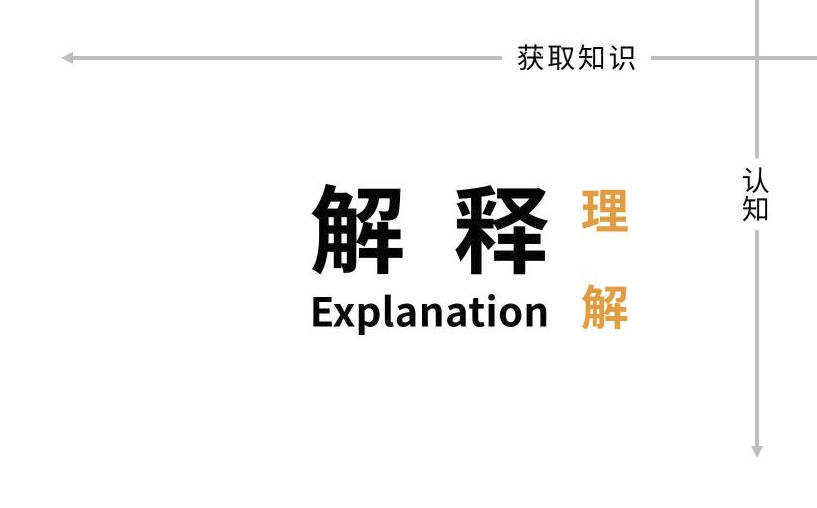
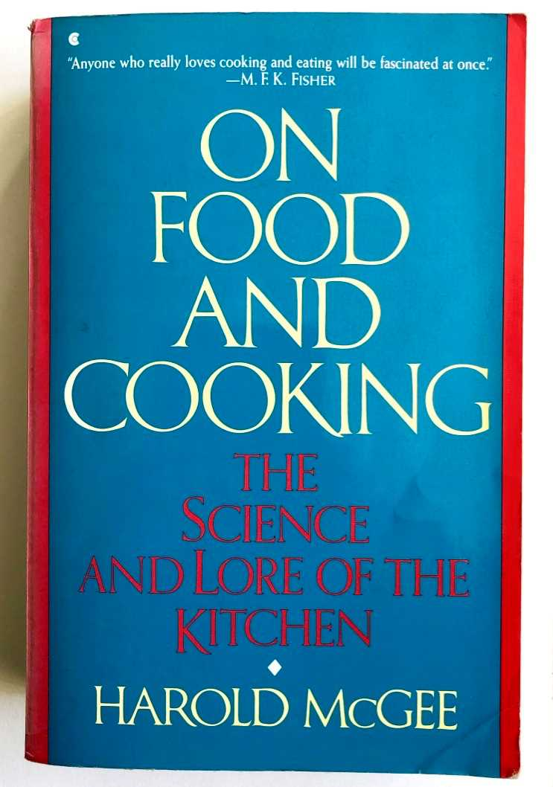


解释是（Explanation）对一个主题的讨论性处理，允许反思，解释是以理解为导向的。


解释加深并拓宽了读者对某个主题的理解，它拨开迷雾让相关信息更清晰。

反思的概念很重要。反思发生在其他事物之后，并且依赖于其他事物，但同时也给主题带来了新的东西 —— 历久弥新。

解释的视角比其他类型更高、更广。它不会像操作指南（how-to guides）那样采用用户的视角，也不会像参考材料（reference material）一样采用机器的视角。在每种案例下，其范围都是一个主题 —— “知识领域”，必须以某种合理、有意义的方式对其进行限制。

对于用户来说，解释将事物连接在一起。它是对这个问题的回答：**你能告诉我……吗？**

这是一种在远离产品时仍能阅读的文档（可以说，解释是唯一一种在洗澡时阅读也可能有意义的文档）。

## 解释的价值和地点

### 解释和理解

解释的特点是与实践者的积极关注点有距离。它对他们所做的事情或他们的工作没有直接影响，这意味着它有时被视为不太重要。这是一个错误；它可能不如其他三个紧迫，但同样重要。这不是奢侈品。任何一门手艺的从业者都不能不了解该手艺，并且需要有助于将其编织在一起的解释材料。

> **解释的其他名称：**您的解释文档不需要叫做“解释（explanation）”。替代方案包括：
> * 讨论（Discussion）
> * 背景（Background）
> * 概念指南（Conceptual guides）
> * 主题（Topics）

解释（explanation）这个词及其在其他语言中的同源词指的是展开（unfolding），即揭示隐藏在褶皱中的东西。因此，解释使隐含或模糊的事情变得清晰。

同样，表示理解（understanding）的词与表示持有（hold）或掌握（grasp）的词有相同的词根（comprehend）。这是理解的重要组成部分：能够持有或拥有某物。理解将我们掌握的一门手艺的其他组成部分封装在一起，并使其安全地成为我们自己的技艺。

理解（Understanding）并非来自解释（explanation），但需要解释才能形成有助于将所有事物结合在一起的网络。没有它，从业者的技艺知识就会松散、支离破碎、脆弱，他们的实践就会令人焦虑。

### 解释及其界限

很多时候，文档中并没有明确包含解释部分，需要对事情进行解释的想法也往往只是模糊地表达出来。相反，解释往往分散在其他部分的小块内容中。

要写出好的解释材料并非易事。从哪里入手呢？也不知道从何说起。有一种开放性，会给作者带来太多的可能性。

教程、使用指南和参考资料的范围都有明确的界定：用户需要学习什么，用户需要完成什么任务，或者仅仅是机器本身的范围。

就解释而言，有一个真实的或想象中的“为什么？”作为提示是非常有用的。除此以外，你只需画出几条线，标出一个合理的范围就可以了。

## 写出好的解释

### 建立联系

在撰写解释时，您正在帮助为读者编织一张理解之网。如果有帮助的话，与其他事物**建立联系**，甚至与当前主题之外的事物建立联系。

## 提供上下文

**在您的解释中提供背景和上下文信息**：解释为什么事情会这样（设计决策、历史原因、技术限制），解释隐喻的含义，提及具体示例。

## 谈论主题

> * 要讨论的事情
>   * 更大的愿景
>   * 历史
>   * 选择、替代方案、可能性
>   * 为什么：原因和理由

解释指南是关于一个主题的，因为它们围绕着一个主题。甚至你的解释指南的名称也应该反映这一点，你应该试着让每个标题以“关于”开头。例如：关于用户身份验证、关于数据库连接策略。

### 承认意见和观点

将意见引入文档似乎是一件有趣的事情。事实上，所有人类活动和知识都融入了观点、信念和思想。任何人类创造的现实都充满了观点，这需要成为对它的任何理解的一部分。

同样，任何理解都来自一个角度、一个特定的立场（这意味着还存在其他的角度和立场）。**解释可以且必须考虑同一问题的替代方案**、反例或多种不同方法。

在解释中，你不是在下达指令或描述事实，而是在打开话题供人思考。将解释视为讨论是有帮助的：讨论甚至可以考虑和权衡相反的意见。

### 保持解释的严密界限

解释的一个风险是，它往往会吸收其他多余的东西。作者一心想涵盖主题，就会有加入相关说明或技术描述的冲动。但是，文档中已经有其他地方可以容纳这些内容，如果允许它们悄然出现，就会干扰解释本身，并使它们从正确的地方消失。

## 解释的用语

1. x 的原因是因为历史上，y ...
    * 解释。
2. W 比 z 更好，因为……
    * 在适当的情况下提供判断甚至意见。
3. y 系统中的 x 类似于 z 系统中的 w。然而 …
    * 提供对读者有帮助的上下文。
4. 有些用户更喜欢 w（因为 z）。这可能是一个好方法，但是……
    * 权衡替代方案。
5. x 与 y 按以下方式交互：……
    * 揭开机器的内部秘密，帮助理解为什么某些东西会这样做。

## 以食品和烹饪为例

1984 年，[Harold McGee](https://www.curiouscook.com/) 出版了《论食物与烹饪》。

这本书没有教如何烹饪任何东西。它不包含食谱（历史示例除外），也不是参考书。相反，它将食物和烹饪置于历史、社会、科学和技术的背景中。例如，它解释了我们为什么在厨房里做这些事情以及它发生了怎样的变化。

这显然不是一本我们在做饭时会读的书。当我们想要反思烹饪时，我们会阅读。它通过从多个不同的角度照射主题，从不同的角度照射光线来照亮主题。

读了《论食物和烹饪》这样的书后，我们的理解发生了改变。我们的知识更加丰富、更加深入。我们所学到的知识可能会或可能不会立即适用于下次我们在厨房做某事时，但它会改变我们对工艺的看法，并会影响我们的实践。
