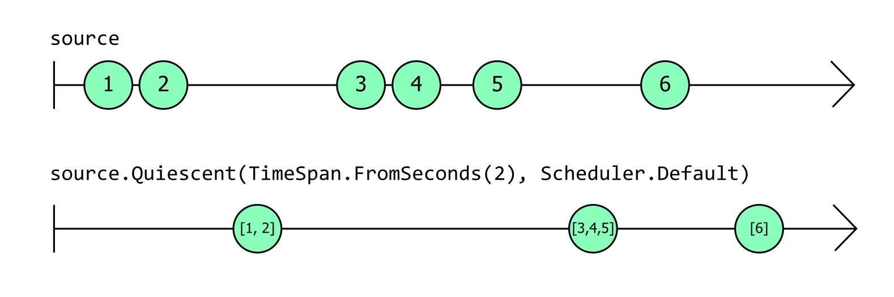
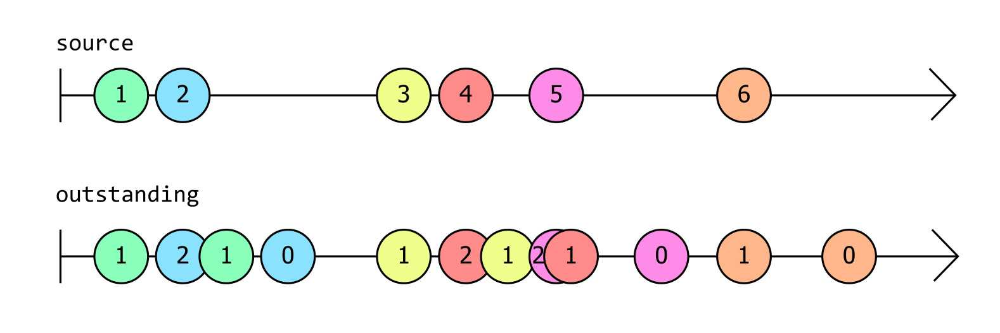
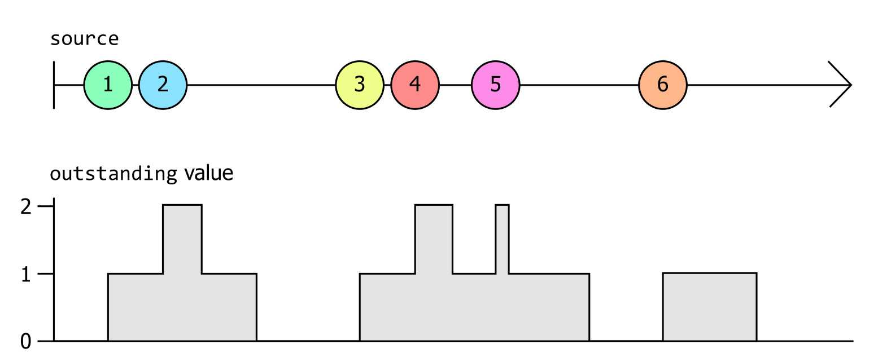
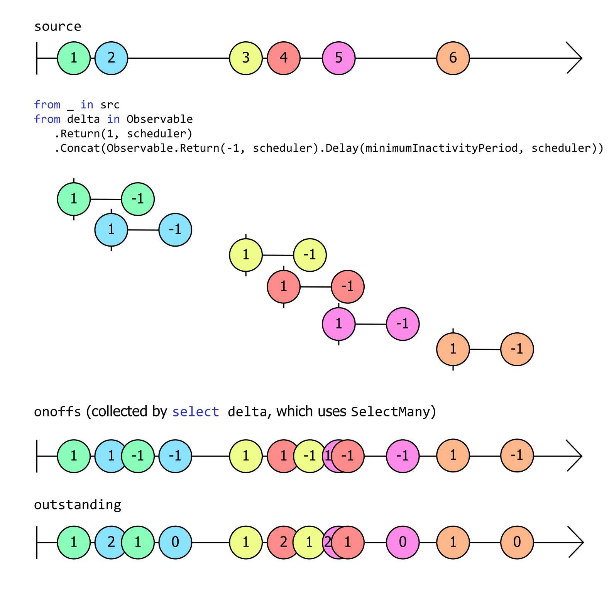

Rx 功能强大，可以极大地简化响应事件的代码。但要写好响应式代码，您必须了解一些基本概念。 Rx 的基本构建块是一个名为 `IObservable<T>` 的接口，与其相对应的是名为 `IObserver<T>` 的接口。理解这两个接口是成功使用 Rx 的关键。

前面的章节将这个 LINQ 查询表达式作为第一个示例展示给读者：

```C#
var bigTrades =
    from trade in trades
    where trade.Volume > 1_000_000;
```

大多数 .NET 开发人员至少会熟悉 [LINQ](https://learn.microsoft.com/en-us/dotnet/csharp/linq/) 的多种流行形式之一，例如 [LINQ to Objects](https://learn.microsoft.com/en-us/dotnet/csharp/programming-guide/concepts/linq/linq-to-objects) 或 [Entity Framework Core 查询](https://learn.microsoft.com/en-us/ef/core/querying/)。大多数 LINQ 实现允许您查询静态数据。LINQ to Objects 适用于数组或其他集合，Entity Framework Core 中的 LINQ 查询针对数据库中的数据，但 Rx 不同：它提供了查询实时事件流（您可能称之为动态数据）的能力。

如果您不喜欢查询表达式语法，也可以直接调用 LINQ 运算符来编写完全相同的代码：

```C#
var bigTrades = trades.Where(trade => trade.Volume > 1_000_000);
```

它们都是 LINQ 的表达方式，表示我们希望 bigTrades 仅包含 trades 中 Volume 属性大于一百万的项。

我们无法准确说明这些示例的作用，因为我们看不到 trades 或 bigTrades 变量的类型。类型不同，代码的含义也会有很大差异。如果我们使用 LINQ to objects，这两个变量的类型可能是 `IEnumerable<Trade>` 。也就是说这两个变量都引用了表示集合的对象，而我们可以使用 `foreach` 循环枚举其内容；同时它们表示静态数据，即我们的代码可以直接检查的数据。

所以我们需要通过明确类型来明确代码的含义：

```C#
IObservable<Trade> bigTrades = trades.Where(trade => trade.Volume > 1_000_000);
```

这样就消除了歧义。现在很明显，我们处理的不是静态数据。我们正在使用 `IObservable<Trade>` 。但这到底是个啥？

## IObservable<T>

[`IObservable<T>`](https://learn.microsoft.com/en-us/dotnet/api/system.iobservable-1) 接口代表了 Rx 的基本抽象：若干 T 类型的值组成的序列。从非常抽象的意义上来说，这意味着它和 `IEnumerable<T>` 代表着相同的东西。

区别在于代码如何使用这些值。 `IEnumerable<T>` 使代码能够（主动地）检索值（通常使用 `foreach` 循环），而 `IObservable<T>` 在值可用时提供值。这种区别有时被描述为“推送式（push）”与“拉取式（pull）”。我们可以通过执行 `foreach` 循环从 `IEnumerable<T>` 中提取值，但 `IObservable<T>` 会将值推送到我们的代码中。

`IObservable<T>` 如何将值推送到我们的代码中？如果我们想要这些值，我们的代码必须订阅 `IObservable<T>` ，也就是说为其提供一些可以调用的方法。事实上，“订阅（Subscribe）”是 `IObservable<T>` 直接支持的唯一操作。这是接口的完整定义：

```C#
public interface IObservable<out T>
{
    IDisposable Subscribe(IObserver<T> observer);
}
```

您可以在 GitHub 上查看 `IObservable<T>` 的[源代码](https://github.com/dotnet/runtime/blob/b4008aefaf8e3b262fbb764070ea1dd1abe7d97c/src/libraries/System.Private.CoreLib/src/System/IObservable.cs)。请注意，它是 .NET 运行时库的一部分，而不是 System.Reactive NuGet 包的一部分。 `IObservable<T>` 代表了一个极其重要的抽象，因此它被融入到 .NET 中。 （您可能想知道 System.Reactive NuGet 包的用途。.NET 运行时库只定义了 `IObservable<T>` 和 `IObserver<T>` 接口，而不包括 LINQ 实现。 System.Reactive NuGet 包为我们提供了 LINQ 支持，同时还能处理多线程。）

这个接口唯一的方法清楚地表明了我们可以用 `IObservable<T>` 做什么：如果我们想接收它提供的事件，我们需要订阅它。我们也可以取消订阅： `Subscribe` 方法返回 `IDisposable` ，如果我们调用 `Dispose` ，它就会取消我们的订阅。`Subscribe` 方法要求我们传入 `IObserver<T>` 的实现，这点我们待会儿再说。

细心的读者会发现前一章中的示例似乎不符合 `Subscribe` 方法的要求。该代码创建了一个每秒生成一次事件的 `IObservable<long>` ，然后使用以下代码订阅它：

```C#
ticks.Subscribe(
    tick => Console.WriteLine($"Tick {tick}"));
```

这是在传递一个委托，而不是 `IObservable<T>.Subscribe` 所需的 `IObserver<T>` 。我们很快就会提到 `IObserver<T>` ，但这里示例使用的是 System.Reactive NuGet 包中的一个扩展方法：

```C#
// From the System.Reactive library's ObservableExtensions class
public static IDisposable Subscribe<T>(this IObservable<T> source, Action<T> onNext)
```

这是一个辅助方法，它将委托包装在一个 `IObserver<T>` 的实现中，然后将其传递给 `IObservable<T>.Subscribe`。于是我们可以只编写一个简单的方法（而不是 `IObserver<T>` 的完整实现），并且可观察源每次想要提供值时都会调用我们提供的回调。使用这种辅助方法比我们自己实现 Rx 的接口更常见。

## 热源（Hot Source）和冷源（Cold Source）

由于 `IObservable<T>` 不能在订阅之前向订阅者提供值，因此订阅的时间就很重要了。试想，`IObservable<Trade>` 表示某个市场中发生的交易。如果它提供的信息是实时的，那么它不会告诉您任何在您订阅源之前发生的交易。在 Rx 中，此类源被描述为热源（Hot Source）。

并非所有的源都是热源。有些 `IObservable<T>` 始终向所有订阅者提供完全相同的事件序列，无论这些订阅者是什么时候订阅的（试想 `IObservable<Trade>` 不是报告实时信息，而是根据记录的历史交易数据生成通知）。不用关心订阅时间的源称为冷源（Cold Source）。

以下是一些热源的例子：

* 传感器的测量数据

* 交易所的价格变动

* 立即分发事件的事件源，例如 Azure 事件网格

* 鼠标移动

* 定时器事件

* 广播，如 ESB 通道或 UDP 网络数据包

以及一些冷源的示例：

* 集合的内容（例如 `IEnumerable<T>` 的 [`ToObservable`](https://www.introtorx.com/chapters/creating-observable-sequences.html#from-ienumerablet) 扩展方法返回的内容）

* 固定范围的一系列值，例如 [`Observable.Range`](https://www.introtorx.com/chapters/creating-observable-sequences.html#observablerange) 产生的源

* 基于算法生成的事件，例如 [`Observable.Generate`](https://www.introtorx.com/chapters/creating-observable-sequences.html#observablegenerate) 产生的源

* 用于异步操作的工厂，例如 [`FromAsync`](https://www.introtorx.com/chapters/creating-observable-sequences.html#from-task) 返回的源

* 运行常规代码（例如循环）产生的事件；您可以使用 [`Observable.Create`](https://www.introtorx.com/chapters/creating-observable-sequences.html#observablecreate) 创建此类源

* 流事件（streaming event）提供者，例如 Azure 事件中心或 Kafka（或任何其他流式源（streaming-style source），它们保留过去的事件，以便能够传递流中特定时刻的事件，刚好与 Azure 事件网格中的事件源风格相反）

并非所有源都可以被简单地分成热源或冷源。我们再回顾一下实时源 `IObservable<Trade>` 的一些细节：该源始终向新订阅者报告离他最近的交易，订阅者在订阅后可以立即收到信息（译注：这个信息是最近的，但不一定是最新的），之后每当新信息到达时都能了解最新情况。事实上新订阅者总是会收到（可能很旧的）信息，这点和冷源很像，但只有第一个接收到的事件是冷的。一个新的订阅者仍然有可能错过许多早期订阅者可以获得的信息，这点又和热源的特征很像。

有一个有趣的特殊情况：事件源被设计为应用程序能够按顺序接收每个事件，并且只接收一次。像 Kafka 或 Azure Event Hub 之类的事件流系统就具有这样的特点——它们将事件保留一段时间，以确保消费者即使偶尔落后也不会错过。进程的标准输入 (stdin) 也具有此特征：如果您运行命令行工具并在它准备好处理输入之前开始敲键盘，操作系统会将该输入保存在缓冲区中，以确保不会丢失任何内容。Windows 对桌面应用程序也做了类似的事情：每个应用程序线程都有一个消息队列，这样您如果在应用程序无法响应时点击鼠标或敲击键盘，输入最终将被处理。我们可以认为这些源先冷后热：它们就像冷源一样，我们不会因为订阅后花了一些时间才开始接收事件而错过任何东西，但一旦我们开始检索数据，我们通常就无法倒回到开始处。因此，一旦我们开始运行，它们就更像热源。

如果我们想要附加多个订阅者，这种先冷后热的源可能会出现问题。如果订阅发生后源就开始提供事件，那么这对第一个订阅者来说没问题，它将接收所有已备份、待处理的事件；但如果我们想要附加多个订阅者，就会遇到一个问题：在我们设法附加上第二个订阅者之前，第一个订阅者可能会接收在某个缓冲区中静待处理的所有通知。第二个订阅者将会错过这些通知。

此时我们会希望在开始之前以某种方式来预先配置好所有订阅者。我们希望订阅与启动行为分开。默认情况下，订阅一个源意味着我们希望源启动，但 Rx 定义了一个专门的接口，可以为我们提供更多控制手段： [`IConnectableObservable<T>`](https://github.com/dotnet/reactive/blob/f4f727cf413c5ea7a704cdd4cd9b4a3371105fa8/Rx.NET/Source/src/System.Reactive/Subjects/IConnectableObservable.cs) 。它派生自 `IObservable<T>` ，并仅添加一个方法 `Connect` ：

```C#
public interface IConnectableObservable<out T> : IObservable<T>
{
    IDisposable Connect();
}
```

如果我们有若干获取或生成事件的进程，并且我们需要确保在开始之前做好准备，那么这个接口会非常有用。由于 `IConnectableObservable<T>` 在您调用 `Connect` 之前不会启动，因此通过它您可以在事件开始流动之前附加任意数量的订阅者。

源的“冷/热”不一定能从其类型中明显看出。即使底层源是一个 `IConnectableObservable<T>` ，它也往往会隐藏在层层代码之后。因此，无论源是热源、冷源还是介于两者之间的源，大多数时候我们只能看到一个 `IObservable<T>` 。由于 `IObservable<T>` 只定义了一个 `Subscribe`方法，您可能想知道我们会如何用它做有趣的事。答案是使用 System.Reactive NuGet 包提供的 LINQ 运算符。

## LINQ 运算符及其组合

到目前为止，我仅展示了一个非常简单的 LINQ 示例：使用 Where 运算符将事件筛选为满足特定条件的事件。为了让您知道如何通过组合 LINQ 运算符构建更高级的功能，我将介绍一个示例场景。

假设您想编写一个程序来监视文件系统上的某个文件夹，并在该文件夹中的某些内容发生更改时执行自动处理（比如 Web 开发人员通常希望在编辑器中保存更改时触发客户端代码的自动重建，以便快速查看更改的效果）。文件系统更改通常会突然发生；保存文件时，文本编辑器可能会执行一些其他操作（有些编辑器将修改保存到新文件，然后在完成后执行几次重命名，这样可以避免在保存文件时发生电源故障或系统崩溃导致的数据丢失）。因此我们通常不在检测到文件活动后立即采取行动，最好给它一点时间，看看是否有更多活动发生，并在一切尘埃落定后才采取行动。

要做到这点，Rx 不直接提供此功能，但我们可以通过组合一些内置运算符来创建自定义运算符。以下代码定义了一个 Rx 运算符来检测并报告此类事件。如果您还不太熟悉 Rx，可能没法一眼看出它是如何工作的。与我迄今为止展示过的示例相比，这个示例难度陡然上升，因为它来自真实的应用程序，但我会一步一步讲解清楚。

```C#
static class RxExt
{
    public static IObservable<IList<T>> Quiescent<T>(
        this IObservable<T> src,
        TimeSpan minimumInactivityPeriod,
        IScheduler scheduler)
    {
        IObservable<int> onoffs =
            from _ in src
            from delta in 
               Observable.Return(1, scheduler)
                         .Concat(Observable.Return(-1, scheduler)
                                           .Delay(minimumInactivityPeriod, scheduler))
            select delta;
        IObservable<int> outstanding = onoffs.Scan(0, (total, delta) => total + delta);
        IObservable<int> zeroCrossings = outstanding.Where(total => total == 0);
        return src.Buffer(zeroCrossings);
    }
}
```

首先要说的是，我们实际上正在定义一个自定义 LINQ 风格的运算符：这是一个扩展方法，与 Rx 提供的所有 LINQ 运算符一样，它采用 `IObservable<T>` 作为其隐式参数，并产生另一个可观察的源作为其结果。返回类型略有不同：它是 `IObservable<IList<T>>` 。这是因为一旦我们返回到不活动状态，我们将希望处理刚刚发生的所有事情，因此该运算符将生成一个列表，其中包含源在最近的一系列活动中报告的每个值。

当我们想要展示 Rx 运算符的行为方式时，我们通常会绘制“弹珠图”。这是一张显示一个或多个 `IObservable<T>` 事件源的图，每个事件源都用一条水平线表示。源产生的每个事件都用该线上的圆圈（或称为“弹珠”）来说明，水平位置表示时间。通常，该线的左侧有一个垂直条，指示应用程序订阅源的时刻（除非源在订阅发生时立即产生事件，这时线的左侧是一个弹珠）。如果该线的右侧有箭头，则表明可观察量的生命周期超出了图表。下面的图表显示了上面的 `Quiescent` 运算符如何响应特定输入：



图中源（顶行）产生了几个事件（在本例中为值 `1` 和 `2` ），然后停顿一会儿。停顿后不久， `Quiescent` 运算符返回的可观察对象（下面一行）生成了一个事件，其中包含包含这两个事件的列表（ `[1,2]` ）。然后源再次启动，以相当快的速度连续生成值 `3` 、`4` 和 `5`，然后停顿一会儿。同样，一旦停顿期持续足够长的时间， `Quiescent` 返回的源就会生成一个事件，其中包含第二波突发事件（ `[3,4,5]` ）中的所有事件。之后发生的第三波事件中只有一个事件 `6`，一旦事件 `6` 之后的停顿持续足够长的时间，`Quiescent` 源产生一个事件来报告这一点。由于来自源的最后一次突发活动仅包含一个事件，因此 `Quiescent` 可观察对象的最终输出的列表是只有单个值的列表： `[6]` 。

那么之前那段代码是如何实现这一目标的呢？关于 `Quiescent` 方法首先要注意的是，它只是使用其他现有的 Rx LINQ 运算符（ `Return` 、 `Scan` 、 `Where` 、和 `Buffer` 运算符是显式可见的，并且查询表达式将隐式使用 `SelectMany` 运算符，因为有个 C# 查询表达式在一行包含了两个 `from` 子句）进行组合，最终生成一个 `IObservable<IList<T>>`。

这就是 Rx 的组合方式，也是我们通常使用 Rx 的方式。我们组合使用现有的运算符，以产生我们想要的效果的方式组合（组合）。

但这种特殊的组合如何产生我们想要的效果呢？我们有几种方法来实现 `Quiescent` 运算符，而上文这个实现的基本思想是它记录最近发生的事件数量，然后每当该数字回落到零时就会产生一个结果（译注：请往下读，理解算法原理后再回顾一下这句话）。代码中的 `outstanding` 变量是一个跟踪最近发生的事件数量的 `IObservable<int>` ，此弹珠图显示了它如何响应上图中的的 `source` 事件源并生成一个新的事件源：



这张图里我用颜色对事件进行了标记，这样可以显示 `source` 事件与 `outstanding` 生成的相应事件之间的关系。每次 `source` 产生一个事件时， `outstanding` 同时产生一个事件，它的值比 `outstanding` 产生的前一个事件的值高 1；此事件产生两秒后 `outstanding` 会产生另一个事件，它的值比 `outstanding` 产生的前一个事件的值低 1（“两秒”是因为在示例中我假设 `Quiescent` 的第一个参数是 `TimeSpan.FromSeconds(2)`，就像第一个弹珠图所示）。

这意味着 `outstanding` 中出现的每个事件都会告诉我们过去两秒内产生了多少个 `source` 事件。下图用另一种形式展示了相同的信息：它以图表的形式显示了 `outstanding` 生成的最新值。您可以看到，每次 `source` 产生新值时，`outstanding` 值都会 +1；在 `source` 生成每个值两秒后，它会 -1。



在简单的情况下，例如最终事件 `6` ，它是在该时间附近发生的唯一事件，当事件发生时 `outstanding` 值会 +1，然后两秒钟后 -1。在图片的最左侧，情况稍微复杂一些：我们以相当快的速度连续获得两个事件，因此 `outstanding` 值上升到 1，然后上升到 2，然后回落到 1，然后再次降至零。中间部分看起来有点混乱：

* 当 `source` 产生事件 `3` 时，`outstanding` 值增加到 1；
* 当事件 `4` 到来时，`outstanding` 值增加到 2；
* 当 `3` 事件过去两秒时，`outstanding` 值就会再次下降到 1；
* 但随后出现了另一个事件 `5`，使 `outstanding` 值再次回到 2；
* 不久之后，`outstanding` 值再次回落到 1，因为距离 `4` 事件发生已经过去了两秒；
* 最后，在 `5` 事件发生两秒后，`outstanding` 值回落到零。

中间部分是最混乱的，但它也最能代表该运算符要处理的活动类型。请记住，这里的要点是，我们期望看到大量的活动，如果这些活动代表文件系统活动，那么它们本质上往往会有点混乱，因为存储设备并不总是具有完全可预测的性能特征（特别是如果它是一种带有移动部件的磁性存储设备，或者是远程存储，其中可能会出现可变的网络延迟）。

有了对近期活动的测量，我们可以通过观察 `outstanding` 何时回落到零来确定活动爆发期的结束，这就是 `zeroCrossing` 中的事件。正如上面的代码所示（只需要用 `Where` 运算符过滤出 `outstanding` 生成的值为 0 的事件）。

但是 `outstanding` 本身是如何工作的呢？每次 `source` 产生一个值时，我们实际上创建了一个全新的 `IObservable<int>` ，它恰好产生两个值。它立即生成值 1，然后在指定的时间跨度（本例中为 2 秒）后生成值 -1。这就是 `onoffs` 子句中的部分内容：

```C#
from delta in Observable
    .Return(1, scheduler)
    .Concat(Observable
        .Return(-1, scheduler)
        .Delay(minimumInactivityPeriod, scheduler))
```

我说过 Rx 就是关于“组合”的框架，这里也一样。我们用一个简单的 `Return` 运算符来创建一个 `IObservable<int>` ，它立即生成一个值，然后终止。我们使用了两次，一次生成值 1 ，另一次生成值 -1。第二个 `Return` 运算符后面跟了一个 `Delay` 运算符，这样我们就不会立即得到 -1 值，而是在产生值之前延迟一段时间（在本例中 `minimumInactivityPeriod` 为 2 秒）。然后我们使用 `Concat` 运算符将这两个 `Return` 运算符拼接在一起形成一个先生成值 1、两秒后生成值 -1 的`IObservable<int>`。

尽管这会为每个 `source` 事件生成一个全新的 `IObservable<int>` ，但上面显示的 `from` 子句是查询表达式 `from ... from .. select` 的一部分，C# 编译器将其转换为对 `SelectMany` 的调用，其效果是将它们全部合并为单个可观察量，这就是 `onoffs` 变量的内容。下面这个弹珠图展示了这点：



图中也展示了 `outstanding`，但我们现在可以看到它的来源：`outstanding` 累加 `onoffs` 生成的值，并在 `onoffs` 产生值的同时生成包含当前累加值的事件。这个过程通过以下代码实现：

```C#
IObservable<int> outstanding = onoffs.Scan(0, (total, delta) => total + delta);
```

Rx 的 `Scan` 运算符的工作方式与标准 LINQ 的 [`Aggregate`](https://learn.microsoft.com/en-us/dotnet/csharp/programming-guide/concepts/linq/aggregation-operations) 运算符非常相似，因为它会将操作（在本例中为加法）累积地应用于序列中的每个项。不同之处在于，`Aggregate` 只在到达序列末尾时生成最终结果，而 `Scan` 在每次获得输入后都会生成到目前为止的累积值。这意味着每次 `onoffs` 生成一个事件时，`outstanding` 都会生成一个事件，并且该事件的值是当前的累加值。

这就是 `outstanding` 如何告诉我们过去的 `minimumActivityPeriod` 内（本例为 2 秒）产生了多少个 `source` 事件的算法原理。

难题的最后一部分是我们如何从 `IObservable<int>` 类型的 `zeroCrossings`（每次源静止时产生一个事件）生成并返回 `IObservable<IList<T>>`（它提供了最近一次活动爆发期中发生的所有事件）。这里我们只使用 Rx 的 `Buffer` 运算符，它是专门为这种场景而设计的：它将输入切成块，为每个块生成一个事件，其值为 `IList<T>` 类型，它的项就是这个块的项。`Buffer` 可以通过几种方法对目标进行切片，在本例中，我们使用的方法是在每次 `IObservable<T>` 生成一个项目时创建一个新切片。具体来说，我们告诉 `Buffer` 在每次 `zeroCrossings` 产生新事件时创建一个新块来分割 `source`。

（最后一点，该方法需要一个 `IScheduler` 。这是一个用于处理时序和并发性的 Rx 抽象。我们需要它，因为我们需要能够一秒延迟后生成事件，这种时间驱动的活动需要调度程序。）

我们将在后面的章节中更详细地介绍所有这些运算符和调度程序的工作原理。目前，我们只需要知道我们一般通过创建 LINQ 运算符的组合来使用 Rx，这些运算符处理和组合 `IObservable<T>` 源来定义我们所需的逻辑。

请注意，该示例中没有任何内容实际调用 `IObservable<T>` 定义的唯一方法（ `Subscribe` ）。总会有一些东西最终会使用事件，但是使用 Rx 的大部分工作往往需要声明性地定义我们需要的 `IObservable<T>` 。

现在您已经看到了 Rx 编程的示例，我们可解答一些关于 Rx 为何存在的明显问题。

## 为什么不用 .NET 事件？

从二十多年前发布的第一个版本开始，.NET 就内置了对事件的支持——事件是 .NET 类型系统的一部分。 C# 语言以 `event` 关键字的形式对事件提供原生支持，并提供用于订阅事件的专用语法。那为什么大约 10 年后 Rx 出现时，它觉得有必要发明自己的事件流表示形式呢？`event` 关键字有什么问题？

.NET 事件的基本问题是它们需要通过 .NET 类型系统进行特殊处理。讽刺的是，这使得它们对比没有内置事件支持的情形更不灵活。如果没有 .NET 事件，我们必然需要某种基于对象（object）的事件表示，此时您可以像处理其他对象一样处理事件：您可以将它们存储在字段中、将它们作为方法的参数传递、给它们定义方法等等。

公平地说，.NET 版本 1 确实不可能在没有泛型的情况下定义良好的基于​​对象的事件表示，并且 .NET 直到版本 2 才实现这些（.NET 1.0 发布三年半后）。不同的事件源需要报告不同的数据，而 NET 事件提供了一种按类型参数化事件的方法。但是一旦泛型出现，就可以定义诸如 `IObservable<T>` 之类的类型，并且事件提供的主要优势就消失了（另一个好处是有了一些与实现和订阅事件相关的语言支持，但原则上，如果 Microsoft 愿意 Rx 也能拥有这些语言支持。这个特性并不要求事件与类型系统的其他特性有根本区别）。

考虑一下我们刚刚完成的例子。可以定义我们自己的自定义 LINQ 运算符 `Quiescent`，因为 `IObservable<T>` 只是一个普通的接口，这意味着我们可以自由地为其编写扩展方法，而您无法为事件编写扩展方法。

此外，我们还能够包装或改造 `IObservable<T>` 源。`Quiescent` 将 `IObservable<T>` 作为输入，并组合各种 Rx 运算符以生成另一个可观察量作为输出。它的输入是可以订阅的事件源，它的输出也是可以订阅的事件源。您无法使用 .NET 事件实现这点——您无法编写接受事件作为参数或返回事件的方法。

这些限制有时被描述为“.NET 事件不是一等公民”。有些事情可以用 .NET 中的值类型或引用类型来完成，而不能用事件来完成。

如果我们将事件源表示为普通的旧接口，那么它就是一等公民：它可以使用我们期望的其他对象和值的所有功能，正是因为它不是什么特殊的东西。

## 流（Stream）呢？

我之前说 `IObservable<T>` 可以表示事件流。这就有了一个明显的问题：.NET 已经有了 `System.IO.Stream` 流，为什么不直接使用它呢？

简而言之，流很奇怪，因为它们代表了一个古老的计算概念，可以追溯到第一个 Windows 操作系统发布之前很久，因此它们有相当多的历史包袱。这意味着即使是像“我有一些数据，并且希望立即将其提供给所有感兴趣的各方”这样简单的场景，通过 `Stream` 类型实现起来也非常复杂。

此外， `Stream` 不提供任何方法来指示将出现什么类型的数据——它只知道字节。由于.NET的类型系统支持泛型，因此很自然地会希望表示事件流的类型通过类型参数来指示事件类型。

因此，即使您确实使用 `Stream` 作为实现的一部分，您也需要引入某种包装器抽象。比如若是 `IObservable<T>` 不存在，您就需要发明它。

当然可以在 Rx 中使用 IO 流，但它们也不合适。（如果您不相信，请参阅 [附录 A：经典 IO 流有何问题](../../appendix/a.1-classic-io-streams-problems/)）

现在我们已经了解了为什么需要 `IObservable<T>`，接下来让我们看看和它相对的 `IObserver<T>`。

## IObserver<T>

之前，我展示了 `IObservable<T>` 的定义。正如您所看到的，它只有一个方法 `Subscribe`。该方法只接受一个 `IObserver<T>` 类型的参数。因此，如果您想观察 `IObservable<T>` 提供的事件，则必须为其提供一个 `IObserver<T>` 类型的参数。到目前为止，我们只是提供了一个简单的回调，然后 Rx 将其包装在 `IObserver<T>` 的实现中。一般情况下这就能满足我们的需求了，您仍然需要进一步了解 `IObserver<T>` 才能有效地使用 Rx，它不是一个复杂的接口：

```C#
public interface IObserver<in T>
{
    void OnNext(T value);
    void OnError(Exception error);
    void OnCompleted();
}
```

与 `IObservable<T>` 一样，您可以在 .NET 运行时 GitHub 存储库中找到 [`IObserver<T>`](https://github.com/dotnet/runtime/blob/7cf329b773fa5ed544a9377587018713751c73e3/src/libraries/System.Private.CoreLib/src/System/IObserver.cs) 的源代码，因为这两个接口都内置于运行时库中。

如果我们想创建一个将值打印到控制台的观察者，那么就像这样简单：

```C#
public class MyConsoleObserver<T> : IObserver<T>
{
    public void OnNext(T value)
    {
        Console.WriteLine($"Received value {value}");
    }

    public void OnError(Exception error)
    {
        Console.WriteLine($"Sequence faulted with {error}");
    }

    public void OnCompleted()
    {
        Console.WriteLine("Sequence terminated");
    }
}
```

在前一章中，我使用了 `Subscribe` 扩展方法，该方法接受一个委托，每次源生成项目时都会调用该委托。该方法由 Rx 的 `ObservableExtensions` 类定义，该类还为 `IObservable<T>` 定义了各种其他扩展方法。它包含 `Subscribe` 的重载，使我能够编写与前面的示例功能一样的代码，而无需提供我自己的 `IObserver<T>` 实现：

```C#
source.Subscribe(
    value => Console.WriteLine($"Received value {value}"),
    error => Console.WriteLine($"Sequence faulted with {error}"),
    () => Console.WriteLine("Sequence terminated")
);
```

在这个 `Subscribe` 扩展方法中如果我们不传递完整的三个方法（例如，我之前的示例只提供了与 `OnNext` 对应的单个回调）就相当于编写一个相应方法为空方法的 `IObserver<T>`。不管我们是选择自己实现 `IObserver<T>` 还是选择提供三个方法中的几个或全部回调，`Subscribe` 方法的基本行为是相同的：`IObservable<T>` 源通过调用 `OnNext` 报告每个事件，并通过调用 `OnError` 或 `OnCompleted` 告诉我们事件已经结束。

如果您想知道 `IObservable<T>` 和 `IObserver<T>` 之间的关系是否类似于 [`IEnumerable<T>`](https://learn.microsoft.com/en-us/dotnet/api/system.collections.generic.ienumerable-1) 和 [`IEnumerator<T>`](https://learn.microsoft.com/en-us/dotnet/api/system.collections.generic.ienumerator-1) 之间的关系，那么您就想到点子上了。`IEnumerator<T>` 和 `IObservable<T>` 都代表潜在的序列。对于这两个接口，它们只会在我们要求时提供数据。要从 `IEnumerable<T>` 中获取值，需要一个 `IEnumerator<T>`；同样，要从 `IObservable<T>` 中获取值，需要一个 `IObserver<T>`。

这种差异反映了 `IEnumerable<T>` 和 `IObservable<T>` 在获取数据方面最基本的区别：“拉取式（pull）” VS “推送式（push）”。对于 `IEnumerable<T>`，我们要求源为我们创建一个 `IEnumerator<T>` ，然后我们可以使用它来检索项目（这就是 C# `foreach` 循环的作用）；对于 `IObservable<T>`，源不会自己实现 `IObserver<T>`：它期望我们提供一个 `IObserver<T>`，然后它将值推送到该观察者中。

那么为什么 `IObserver<T>` 会有这三个方法呢？我之前说过，在抽象意义上 `IObserver<T>` 与 `IEnumerable<T>` 表示相同的东西。这也许有些抽象，所以我们详细说说： `IObservable<T>` 和 `IObserver<T>` 旨在保留 `IEnumerable<T>` 和 `IEnumerator<T>` 的确切含义，仅改变具体的（事件/数据）消费机制。

要了解这是什么意思，请考虑当您迭代 `IEnumerable<T>`（比如使用 `foreach` 循环）时会发生什么。每次迭代（更准确地说，每次调用枚举器的 `[MoveNext](https://learn.microsoft.com/en-us/dotnet/api/system.collections.ienumerator.movenext)` 方法）都可能发生三种结果：

* `MoveNext` 可以返回 `true` 以指示枚举器的 `[Current](https://learn.microsoft.com/en-us/dotnet/api/system.collections.generic.ienumerator-1.current)` 属性中存在可用值

* `MoveNext` 可能会抛出一个异常

* `MoveNext` 可能会返回 `false` 以指示您已到达集合末尾

这三个结果恰好对应于 `IObserver<T>` 定义的三种方法。我们可以用稍微更抽象的术语来描述这些：

* 这是另一项

* 出了问题

* 没有更多项了

这描述了在使用 `IEnumerable<T>` 或 `IObservable<T>` 时接下来可能发生的三种结果，唯一的区别在于消费者发现结果的方式。对于 `IEnumerable<T>` 源，每次调用 `MoveNext` 都会告诉我们出现了这三种结果中的哪种；对于 `IObservable<T>` 源，它会通过调用 `IObserver<T>` 实现的相应成员来告诉您出现了哪种结果。

## Rx 序列的基本规则

请注意，上面列表中的三个结果中有两个是最终结果。如果您使用 `foreach` 循环迭代一个 `IEnumerable<T>` ，并且它引发异常，则 `foreach` 循环将终止。C# 编译器知道如果 `MoveNext` 抛出了异常，则 `IEnumerator<T>` 就该被终结了，因此编译器会处理（dispose）它，然后允许异常传播。同样，如果到达序列的末尾，那么任务就完成了，编译器也能理解这一点：它为 `foreach` 循环生成的代码会检测 `MoveNext` 何时返回 `false`，当发生这种情况时，它会处理（dispose）枚举器并继续执行循环后的代码。

这些规则可能看起来非常明显，以至于我们在迭代 `IEnumerable<T>` 序列时可能永远不会考虑它们。可能不太明显的是，完全相同的规则也适用于 `IObservable<T>` 序列。如果可观察源告诉观察者序列已结束，或者报告了一个错误，那么无论哪种情况都是源可以对观察者做的最后一件事。

这意味着这些示例将违反规则：

```C#
public static void WrongOnError(IObserver<int> obs)
{
    obs.OnNext(1);
    obs.OnError(new ArgumentException("This isn't an argument!"));
    obs.OnNext(2);  //违反规则！抛出异常后迭代应该终止。
}

public static void WrongOnCompleted(IObserver<int> obs)
{
    obs.OnNext(1);
    obs.OnCompleted();
    obs.OnNext(2);  //违反规则！序列结束后迭代应该终止。
}

//下面两个实例都违反了规则。OnError 和 OnCompleted 不能先后调用。
//只能选择调用一个来结束对序列的观察。
public static void WrongOnErrorAndOnCompleted(IObserver<int> obs)
{
    obs.OnNext(1);
    obs.OnError(new ArgumentException("A connected series of statements was not supplied"));
    obs.OnCompleted();
}

public static void WrongOnCompletedAndOnError(IObserver<int> obs)
{
    obs.OnNext(1);
    obs.OnCompleted();
    obs.OnError(new ArgumentException("Definite proposition not established"));
}
```

以上错误示例跟我们知道的 `IEnumerable<T>` 的特性相对应：

* `WrongOnError` ：如果枚举器从 `MoveNext` 抛出异常，则它已完成，您不能再调用 `MoveNext` ，因此您也不会再获得任何项

* `WrongOnCompleted` ：如果枚举器从 `MoveNext` 返回 `false` ，则它已完成，您不能再调用 `MoveNext` ，因此您也不会再获得任何项

* `WrongOnErrorAndOnCompleted` ：如果枚举器从 `MoveNext` 抛出异常，则意味着它已完成并且您不能再次调用 `MoveNext`，同时它也不能通过从 `MoveNext` 返回 `false` 来告诉它已完成

* `WrongOnCompletedAndOnError` ：如果枚举器从 `MoveNext` 返回 `false`，则它已完成，您不能再次调用 `MoveNext`，它也没有机会抛出异常

因为 `IObservable<T>` 是“推送式（push）”的，所以可观察的源需要负责遵守所有规则。对于“拉取式（pull）”的 `IEnumerable<T>`，由使用 `IEnumerator<T>`（例如 `foreach` 循环）的代码来遵守这些规则。但它们本质上都是相同的规则。

`IObserver<T>` 还有一条附加规则：如果调用 `OnNext`，则必须等待它返回，然后才能对同一个 `IObserver<T>` 进行更多方法调用。这意味着这段代码违反了规则：

```C#
public static void EverythingEverywhereAllAtOnce(IEnumerable<int> obs)
{
    Random r = new();
    for (int i = 0; i < 10000; ++i)
    {
        int v = r.Next();
        Task.Run(() => obs.OnNext(v)); //违反规则！
    }
}
```

这会调用 `obs.OnNext` 10,000 次，但它将这些调用作为要在线程池上运行的单独任务来执行。线程池被设计为能够并行执行工作，而它没法确保对 `OnNext` 的一次调用在下一次调用开始之前完成。我们打破了规则——即我们一旦调用 `OnNext` 方法就必须等待它返回，才能在同一个观察者上继续调用 `OnNext`、`OnError` 或 `OnCompleted` 方法（注意：这假设调用者不会将同一个观察者订阅到多个不同的源。如果这样做就不能保证对其 `OnNext` 的所有调用都会遵守规则，因为不同的源无法知道它们正在与同一个观察者交谈）。

This rule is the only form of back pressure built into Rx.NET: since the rules forbid calling OnNext if a previous call to OnNext is still in progress, this enables an IObserver<T> to limit the rate at which items arrive. If you just don't return from OnNext until you're ready, the source is obliged to wait. However, there are some issues with this. Once schedulers get involved, the underlying source might not be connected directly to the final observer. If you use something like ObserveOn it's possible that the IObserver<T> subscribed directly to the source just puts items on a queue and immediately returns, and those items will then be delivered to the real observer on a different thread. In these cases, the 'back pressure' caused by taking a long time to return from OnNext only propagates as far as the code pulling items off the queue.
此规则是 Rx.NET 中内置的唯一背压形式：由于如果先前对 OnNext 的调用仍在进行中，则规则禁止调用 OnNext ，因此这会启用 IObserver<T> 限制物品到达的速率。如果您在准备好之前才从 OnNext 返回，则源必须等待。然而，这存在一些问题。一旦调度程序介入，底层源可能不会直接连接到最终观察者。如果您使用类似 ObserveOn 的内容，则直接订阅源的 IObserver<T> 可能只是将项目放入队列并立即返回，然后这些项目将被传递给真正的观察者一个不同的线程。在这些情况下，由于从 OnNext 返回需要很长时间而导致的“背压”仅传播到从队列中拉出项目的代码。

It may be possible to use certain Rx operators (such as Buffer or Sample) to mitigate this, but there are no built-in mechanisms for cross-thread propagation of back pressure. Some Rx implementations on other platforms have attempted to provide integrated solutions for this; in the past when the Rx.NET development community has looked into this, some thought that these solutions were problematic, and there is no consensus on what a good solution looks like. So with Rx.NET, if you need to arrange for sources to slow down when you are struggling to keep up, you will need to introduce some mechanism of your own. (Even with Rx platforms that do offer built-in back pressure, they can't provide a general-purpose answer to the question: how do we make this source provide events more slowly? How (or even whether) you can do that will depend on the nature of the source. So some bespoke adaptation is likely to be necessary in any case.)
可以使用某些 Rx 运算符（例如 Buffer 或 Sample ）来缓解这种情况，但没有用于背压跨线程传播的内置机制。其他平台上的一些 Rx 实现已尝试为此提供集成解决方案；过去，当 Rx.NET 开发社区研究这个问题时，有些人认为这些解决方案是有问题的，并且对于什么是好的解决方案还没有达成共识。因此，对于 Rx.NET，如果您在努力跟上时需要安排源放慢速度，则需要引入一些您自己的机制。 （即使使用确实提供内置背压的 Rx 平台，它们也无法提供以下问题的通用答案：我们如何使该源更慢地提供事件？您如何（甚至是否）可以做到这一点取决于来源的性质。因此在任何情况下都可能需要进行一些定制的调整。）

This rule in which we must wait for OnNext to return is tricky and subtle. It's perhaps less obvious than the others, because there's no equivalent rule for IEnumerable<T>—the opportunity to break this rule only arises when the source pushes data into the application. You might look at the example above and think "well who would do that?" However, multithreading is just an easy way to show that it is technically possible to break the rule. The harder cases are where single-threaded re-entrancy occurs. Take this code:
我们必须等待 OnNext 返回的这条规则很棘手且微妙。它可能不如其他规则那么明显，因为 IEnumerable<T> 没有等效的规则 - 仅当源将数据推送到应用程序时才会出现打破此规则的机会。看到上面的例子，您可能会想“谁会这么做呢？”然而，多线程只是证明技术上可以打破规则的一种简单方法。更困难的情况是发生单线程重入的情况。采取这个代码：

public class GoUntilStopped
{
    private readonly IObserver<int> observer;
    private bool running;

    public GoUntilStopped(IObserver<int> observer)
    {
        this.observer = observer;
    }

    public void Go()
    {
        this.running = true;
        for (int i = 0; this.running; ++i)
        {
            this.observer.OnNext(i);
        }
    }

    public void Stop()
    {
        this.running = false;
        this.observer.OnCompleted();
    }
}
This class takes an IObserver<int> as a constructor argument. When you call its Go method, it repeatedly calls the observer's OnNext until something calls its Stop method.
该类采用 IObserver<int> 作为构造函数参数。当您调用其 Go 方法时，它会重复调用观察者的 OnNext 直到有东西调用其 Stop 方法。

Can you see the bug?
你能看到这个错误吗？

We can take a look at what happens by supplying an IObserver<int> implementation:
我们可以通过提供 IObserver<int> 实现来看看会发生什么：

public class MyObserver : IObserver<int>
{
    private GoUntilStopped? runner;

    public void Run()
    {
        this.runner = new(this);
        Console.WriteLine("Starting...");
        this.runner.Go();
        Console.WriteLine("Finished");
    }

    public void OnCompleted()
    {
        Console.WriteLine("OnCompleted");
    }

    public void OnError(Exception error) { }

    public void OnNext(int value)
    {
        Console.WriteLine($"OnNext {value}");
        if (value > 3)
        {
            Console.WriteLine($"OnNext calling Stop");
            this.runner?.Stop();
        }
        Console.WriteLine($"OnNext returning");
    }
}
Notice that the OnNext method looks at its input, and if it's greater than 3, it tells the GoUntilStopped object to stop.
请注意， OnNext 方法查看其输入，如果它大于 3，它会告诉 GoUntilStopped 对象停止。

Let's look at the output:
让我们看看输出：

Starting...
OnNext 0
OnNext returning
OnNext 1
OnNext returning
OnNext 2
OnNext returning
OnNext 3
OnNext returning
OnNext 4
OnNext calling Stop
OnCompleted
OnNext returning
Finished
The problem is right near the end. Specifically, these two lines:
问题已经临近尾声了。具体来说，这两行：

OnCompleted
OnNext returning
This tells us that the call to our observer's OnCompleted happened before a call in progress to OnNext returned. It didn't take multiple threads to make this occur. It happened because the code in OnNext decides whether it wants to keep receiving events, and when it wants to stop, it immediately calls the GoUntilStopped object's Stop method. There's nothing wrong with that. Observers are allowed to make outbound calls to other objects inside OnNext, and it's actually quite common for an observer to inspect an incoming event and decide that it wants to stop.
这告诉我们，对观察者的 OnCompleted 的调用发生在对 OnNext 的调用返回之前。不需要多个线程来实现这一点。发生这种情况是因为 OnNext 中的代码决定是否要继续接收事件，当它想要停止时，它会立即调用 GoUntilStopped 对象的 Stop 方法。这没有什么问题。观察者可以对 OnNext 内的其他对象进行出站调用，实际上观察者检查传入事件并决定要停止是很常见的。

The problem is in the GoUntilStopped.Stop method. This calls OnCompleted but it makes no attempt to determine whether a call to OnNext is in progress.
问题出在 GoUntilStopped.Stop 方法中。这会调用 OnCompleted ，但不会尝试确定是否正在进行对 OnNext 的调用。

This can be a surprisingly tricky problem to solve. Suppose GoUntilStopped did detect that there was a call in progress to OnNext. What then? In the multithreaded case, we could have solved this by using lock or some other synchronization primitive to ensure that calls into the observer happened one at at time, but that won't work here: the call to Stop has happened on the same thread that called OnNext. The call stack will look something like this at the moment where Stop has been called and it wants to call OnCompleted:
这可能是一个非常棘手的问题。假设 GoUntilStopped 确实检测到正在进行对 OnNext 的调用。然后怎样呢？在多线程情况下，我们可以通过使用 lock 或其他一些同步原语来解决这个问题，以确保对观察者的调用一次发生一次，但这在这里不起作用：对 Stop 发生在与 OnNext 相同的线程上。在调用 Stop 并想要调用 OnCompleted 时，调用堆栈将如下所示：

`GoUntilStopped.Go`
  `MyObserver.OnNext`
    `GoUntilStopped.Stop`
Our GoUntilStopped.Stop method needs to wait for OnNext to return before calling OnCompleted. But notice that the OnNext method can't return until our Stop method returns. We've managed to create a deadlock with single-threaded code!
我们的 GoUntilStopped.Stop 方法需要等待 OnNext 返回，然后再调用 OnCompleted 。但请注意，在 Stop 方法返回之前， OnNext 方法无法返回。我们已经成功地用单线程代码造成了死锁！

In this case it's not all that hard to fix: we could modify Stop so it just sets the running field to false, and then move the call to OnComplete into the Go method, after the for loop. But more generally this can be a hard problem to fix, and it's one of the reasons for using the System.Reactive library instead of just attempting to implement IObservable<T> and IObserver<T> directly. Rx has general purpose mechanisms for solving exactly this kind of problem. (We'll see these when we look at Scheduling.) Moreover, all of the implementations Rx provides take advantage of these mechanisms for you.
在这种情况下，修复起来并不难：我们可以修改 Stop ，这样它只需将 running 字段设置为 false ，然后将调用移动到 < b3> 进入 Go 方法，在 for 循环之后。但更一般地说，这可能是一个很难解决的问题，这是使用 System.Reactive 库而不是仅仅尝试实现 IObservable<T> 和 IObserver<T> 的原因之一直接地。 Rx 具有解决此类问题的通用机制。 （当我们查看调度时，我们将看到这些。）此外，Rx 提供的所有实现都为您利用了这些机制。

If you're using Rx by composing its built-in operators in a declarative way, you never have to think about these rules. You get to depend on these rules in your callbacks that receive the events, and it's mostly Rx's problem to keep to the rules. So the main effect of these rules is that it makes life simpler for code that consumes events.
如果您通过以声明方式组合内置运算符来使用 Rx，则您永远不必考虑这些规则。您必须在接收事件的回调中依赖这些规则，而遵守这些规则主要是 Rx 的问题。因此，这些规则的主要作用是，它使使用事件的代码变得更简单。

These rules are sometimes expressed as a grammar. For example, consider this regular expression:
这些规则有时被表达为语法。例如，考虑这个正则表达式：

(OnNext)*(OnError|OnComplete)
This formally captures the basic idea: there can be any number of calls to OnNext (maybe even zero calls), that occur in sequence, followed by either an OnError or an OnComplete, but not both, and there must be nothing after either of these.
这正式捕获了基本思想：可以有任意数量的对 OnNext 的调用（甚至可能是零个调用），这些调用按顺序发生，后跟 OnError 或 OnComplete ，但不能同时存在，并且其中任何一个之后都不能有任何内容。

One last point: sequences may be infinite. This is true for IEnumerable<T>. It's perfectly possible for an enumerator to return true every time MoveNext is returned, in which case a foreach loop iterating over it will never reach the end. It might choose to stop (with a break or return), or some exception that did not originate from the enumerator might cause the loop to terminate, but it's absolutely acceptable for an IEnumerable<T> to produce items for as long as you keep asking for them. The same is true of a IObservable<T>. If you subscribe to an observable source, and by the time your program exits you've not received a call to either OnComplete or OnError, that's not a bug.
最后一点：序列可能是无限的。对于 IEnumerable<T> 来说也是如此。每次返回 MoveNext 时，枚举器完全有可能返回 true ，在这种情况下，对其进行迭代的 foreach 循环将永远不会到达末尾。它可能会选择停止（使用 break 或 return ），或者某些并非源自枚举器的异常可能会导致循环终止，但对于 IEnumerable<T> 只要你不断要求就可以生产物品。 IObservable<T> 也是如此。如果您订阅了可观察源，并且当您的程序退出时，您还没有收到对 OnComplete 或 OnError 的调用，那么这不是一个错误。

So you might argue that this is a slightly better way to describe the rules formally:
因此，您可能会认为这是正式描述规则的稍微更好的方式：

(OnNext)*(OnError|OnComplete)?
More subtly, observable sources are allowed to do nothing at all. In fact there's a built-in implementation to save developers from the effort of writing a source that does nothing: if you call Observable.Never<int>() it will return an IObservable<int>, and if you subscribe to that, it will never call any methods on your observer. This might not look immediately useful—it is logically equivalent to an IEnumerable<T> in which the enumerator's MoveNext method never returns, which might not be usefully distinguishable from crashing. It's slightly different with Rx, because when we model this "no items emerge ever" behaviour, we don't need to block a thread forever to do it. We can just decide never to call any methods on the observer. This may seem daft, but as you've seen with the Quiescent example, sometimes we create observable sources not because we want the actual items that emerge from it, but because we're interested in the instants when interesting things happen. It can sometimes be useful to be able to model "nothing interesting ever happens" cases. For example, if you have written some code to detect unexpected inactivity (e.g., a sensor that stops producing values), and wanted to test that code, your test could use a Never source instead of a real one, to simulate a broken sensor.
更巧妙的是，可观察源被允许什么都不做。事实上，有一个内置的实现可以使开发人员免于编写不执行任何操作的源代码：如果您调用 Observable.Never<int>() ，它将返回 IObservable<int> ，并且如果您订阅该源，它永远不会在你的观察者上调用任何方法。这看起来可能不会立即有用 - 它在逻辑上相当于 IEnumerable<T> ，其中枚举器的 MoveNext 方法永远不会返回，这可能无法有效地区分崩溃。它与 Rx 略有不同，因为当我们对这种“永远不会出现任何项目”行为进行建模时，我们不需要永远阻塞线程来执行此操作。我们可以决定永远不对观察者调用任何方法。这可能看起来很愚蠢，但正如您在 Quiescent 示例中看到的那样，有时我们创建可观察源并不是因为我们想要从中出现的实际项目，而是因为我们对有趣的时刻感兴趣事情发生。有时，能够对“没有发生任何有趣的事情”的情况进行建模会很有用。例如，如果您编写了一些代码来检测意外的不活动（例如，停止产生值的传感器），并且想要测试该代码，您的测试可以使用 Never 源而不是真实的源，模拟损坏的传感器。

We're not quite done with the Rx's rules, but the last one applies only when we choose to unsubscribe from a source before it comes to a natural end.
我们还没有完全了解 Rx 的规则，但最后一个规则仅适用于我们在自然结束之前选择取消订阅源的情况。

## 订阅的生命周期

There's one more aspect of the relationship between observers and observables to understand: the lifetime of a subscription.
观察者和可观察对象之间的关系还有一个方面需要理解：订阅的生命周期。

You already know from the rules of IObserver<T> that a call to either OnComplete or OnError denotes the end of a sequence. We passed an IObserver<T> to IObservable<T>.Subscribe, and now the subscription is over. But what if we want to stop the subscription earlier?
您已经从 IObserver<T> 的规则知道，对 OnComplete 或 OnError 的调用表示序列的结束。我们将 IObserver<T> 传递给 IObservable<T>.Subscribe ，现在订阅结束了。但是如果我们想提前停止订阅怎么办？

I mentioned earlier that the Subscribe method returns an IDisposable, which enables us to cancel our subscription. Perhaps we only subscribed to a source because our application opened some window showing the status of some process, and we wanted to update the window to reflect that's process's progress. If the user closes that window, we no longer have any use for the notifications. And although we could just ignore all further notifications, that could be a problem if the thing we're monitoring never reaches a natural end. Our observer would continue to receive notifications for the lifetime of the application. This is a waste of CPU power (and thus power consumption, with corresponding implications for battery life and environmental impact) and it can also prevent the garbage collector from reclaiming memory that should have become free.
我之前提到过 Subscribe 方法返回 IDisposable ，这使我们能够取消订阅。也许我们只订阅了一个源，因为我们的应用程序打开了一些显示某个进程状态的窗口，并且我们希望更新该窗口以反映该进程的进度。如果用户关闭该窗口，我们就不再使用通知。尽管我们可以忽略所有进一步的通知，但如果我们正在监视的事情永远不会自然结束，这可能会成为一个问题。我们的观察者将在应用程序的生命周期内继续收到通知。这是对 CPU 功率的浪费（因此会造成功耗，相应地影响电池寿命和环境影响），并且还会阻止垃圾收集器回收本应空闲的内存。

So we are free to indicate that we no longer wish to receive notifications by calling Dispose on the object returned by Subscribe. There are, however, a few non-obvious details.
因此，我们可以通过对 Subscribe 返回的对象调用 Dispose 来表明我们不再希望接收通知。然而，还有一些不明显的细节。

## 订阅的处理（Disposal）是可选的

You are not required to call Dispose on the object returned by Subscribe. Obviously if you want to remain subscribed to events for the lifetime of your process, this makes sense: you never stop using the object, so of course you don't dispose it. But what might be less obvious is that if you subscribe to an IObservable<T> that does come to an end, it automatically tidies up after itself.
您不需要对 Subscribe 返回的对象调用 Dispose 。显然，如果您想在进程的生命周期内保持订阅事件，这是有道理的：您永远不会停止使用该对象，因此您当然不会处置它。但可能不太明显的是，如果您订阅的 IObservable<T> 确实结束了，它会自动清理完毕。

IObservable<T> implementations are not allowed to assume that you will definitely call Dispose, so they are required to perform any necessary cleanup if they stop by calling the observer's OnCompleted or OnError. This is unusual. In most cases where a .NET API returns a brand new object created on your behalf that implements IDisposable, it's an error not to dispose it. But IDisposable objects representing Rx subscriptions are an exception to this rule. You only need to dispose them if you want them to stop earlier than they otherwise would.
IObservable<T> 实现不允许假设您肯定会调用 Dispose ，因此如果它们通过调用观察者的 OnCompleted 或 OnError 。这很不寻常。在大多数情况下，.NET API 返回代表您创建的实现 IDisposable 的全新对象，不处置它是错误的。但表示 Rx 订阅的 IDisposable 对象是此规则的一个例外。仅当您希望它们比其他情况更早停止时，您才需要处理它们。

## 取消订阅可能会很慢甚至无效

Dispose won't necessarily take effect instantly. Obviously it will take some non-zero amount of time in between your code calling into Dispose, and the Dispose implementation reaching the point where it actually does something. Less obviously, some observable sources may need to do non-trivial work to shut things down.
Dispose 不一定立即生效。显然，在代码调用 Dispose 和 Dispose 实现达到实际执行某些操作之间需要一些非零的时间。不太明显的是，一些可观察的来源可能需要做一些重要的工作才能关闭。

A source might create a thread to be able to monitor for and report whatever events it represents. (That would happen with the filesystem source shown above when running on Linux on .NET 8, because the FileSystemWatcher class itself creates its own thread on Linux.) It might take a while for the thread to detect that it is supposed to shut down.
源可能会创建一个线程，以便能够监视和报告它所代表的任何事件。 （当在 .NET 8 上的 Linux 上运行时，上面显示的文件系统源会发生这种情况，因为 FileSystemWatcher 类本身在 Linux 上创建自己的线程。）线程可能需要一段时间才能检测到它应该关闭。

It is fairly common practice for an IObservable<T> to represent some underlying work. For example, Rx can take any factory method that returns a Task<T> and wrap it as an IObservable<T>. It will invoke the factory once for each call to Subscribe, so if there are multiple subscribers to a single IObservable<T> of this kind, each one effectively gets its own Task<T>. This wrapper is able to supply the factory with a CancellationToken, and if an observer unsubscribes by calling Dispose before the task naturally runs to completion, it will put that CancellationToken into a cancelled state. This might have the effect of bringing the task to a halt, but that will work only if the task happens to be monitoring the CancellationToken. Even if it is, it might take some time to bring things to a complete halt. Crucially, the Dispose call doesn't wait for that to happen. It will attempt to initiate cancellation but it may return before cancellation is complete.
IObservable<T> 代表一些基础工作是相当常见的做法。例如，Rx 可以采用任何返回 Task<T> 的工厂方法并将其包装为 IObservable<T> 。每次调用 Subscribe 时，它都会调用工厂一次，因此，如果此类 IObservable<T> 有多个订阅者，则每个订阅者实际上都会获得自己的 Task<T> .这个包装器能够为工厂提供 CancellationToken ，如果观察者在任务自然运行完成之前通过调用 Dispose 取消订阅，它将把 CancellationToken 进入取消状态。这可能会导致任务停止，但只有当任务恰好正在监视 CancellationToken 时才会起作用。即使是这样，也可能需要一些时间才能让事情完全停止。至关重要的是， Dispose 调用不会等待这种情况发生。它将尝试启动取消，但可能会在取消完成之前返回。

## 取消订阅 Rx 序列时的规则

The fundamental rules of Rx sequences described earlier only considered sources that decided when (or whether) to come to a halt. What if a subscriber unsubscribes early? There is only one rule:
前面描述的 Rx 序列的基本规则仅考虑决定何时（或是否）停止的源。如果订阅者提前取消订阅怎么办？只有一条规则：

Once the call to Dispose has returned, the source will make no further calls to the relevant observer. If you call Dispose on the object returned by Subscribe, then once that call returns you can be certain that the observer you passed in will receive no further calls to any of its three methods (OnNext, OnError, or OnComplete).
一旦对 Dispose 的调用返回，源将不再对相关观察者进行调用。如果您对 Subscribe 返回的对象调用 Dispose ，那么一旦该调用返回，您就可以确定您传入的观察者将不会再收到对其三个方法中任何一个的调用（ OnNext 、 OnError 或 OnComplete ）。

That might seem clear enough, but it leaves a grey area: what happens when you've called Dispose but it hasn't returned yet? The rules permit sources to continue to emit events in this case. In fact they couldn't very well require otherwise: it will invariably take some non-zero length of time for the Dispose implementation to make enough progress to have any effect, so in a multi-threaded world it it's always going to be possible that an event gets delivered in between the call to Dispose starting, and the call having any effect. The only situation in which you could depend on no further events emerging would be if your call to Dispose happened inside the OnNext handler. In this case the source will already have noted a call to OnNext is in progress so further calls were already blocked before the call to Dispose started.
这看起来似乎很清楚，但它留下了一个灰色区域：当您调用 Dispose 但它尚未返回时会发生什么？在这种情况下，规则允许源继续发出事件。事实上，他们不能很好地要求其他： Dispose 实现总是需要一些非零长度的时间才能取得足够的进展以产生任何效果，所以在多线程世界中它是在对 Dispose 的调用开始和调用产生任何效果之间总是有可能传递事件。唯一可以保证不再出现任何事件的情况是，对 Dispose 的调用发生在 OnNext 处理程序内部。在这种情况下，源已经注意到对 OnNext 的调用正在进行中，因此在对 Dispose 的调用开始之前，进一步的调用已经被阻止。

But assuming that your observer wasn't already in the middle of an OnNext call, any of the following would be legal:
但假设您的观察者尚未处于 OnNext 调用过程中，则以下任何操作都是合法的：

stopping calls to IObserver<T> almost immediately after Dispose begins, even when it takes a relatively long time to bring any relevant underlying processes to a halt, in which case your observer will never receive an OnCompleted or OnError
在 Dispose 开始后几乎立即停止对 IObserver<T> 的调用，即使需要相对较长的时间才能停止任何相关的底层进程，在这种情况下，您的观察者将永远不会收到 < b2> 或 OnError
producing notifications that reflect the process of shutting down (including calling OnError if an error occurs while trying to bring things to a neat halt, or OnCompleted if it halted without problems)
生成反映关闭过程的通知（包括如果在尝试完全停止时发生错误则调用 OnError ，或者如果没有问题停止则调用 OnCompleted ）
producing a few more notifications for some time after the call to Dispose begins, but cutting them off at some arbitrary point, potentially losing track even of important things like errors that occurred while trying to bring things to a halt
在调用 Dispose 开始后一段时间内再生成一些通知，但会在某个任意点切断它们，甚至可能会丢失重要的事情，例如尝试停止时发生的错误
As it happens, Rx has a preference for the first option. If you're using an IObservable<T> implemented by the System.Reactive library (e.g., one returned by a LINQ operator) it is highly likely to have this characteristic. This is partly to avoid tricky situations in which observers try to do things to their sources inside their notification callbacks. Re-entrancy tends to be awkward to deal with, and Rx avoids ever having to deal with this particular form of re-entrancy by ensuring that it has already stopped delivering notifications to the observer before it begins the work of shutting down a subscription.
碰巧的是，Rx 更倾向于第一个选项。如果您使用的是由 System.Reactive 库实现的 IObservable<T> （例如，由 LINQ 运算符返回的库），则很可能具有此特征。这在一定程度上是为了避免观察者尝试在通知回调中对其源执行操作的棘手情况。重入往往很难处理，Rx 通过确保在开始关闭订阅的工作之前已经停止向观察者发送通知，避免了必须处理这种特定形式的重入。

This sometimes catches people out. If you need to be able to cancel some process that you are observing but you need to be able to observe everything it does up until the point that it stops, then you can't use unsubscription as the shutdown mechanism. As soon as you've called Dispose, the IObservable<T> that returned that IDisposable is no longer under any obligation to tell you anything. This can be frustrating, because the IDisposable returned by Subscribe can sometimes seem like such a natural and easy way to shut something down. But basic truth is this: once you've initiated unsubscription, you can't rely on getting any further notifications associated with that subscription. You might receive some—the source is allowed to carry on supplying items until the call to Dispose returns. But you can't rely on it—the source is also allowed to silence itself immediately, and that's what most Rx-implemented sources will do.
这有时会让人们感到困惑。如果您需要能够取消正在观察的某些进程，但需要能够观察它所做的一切直到它停止为止，那么您不能使用取消订阅作为关闭机制。一旦您调用了 Dispose ，返回 IDisposable 的 IObservable<T> 就不再有义务告诉您任何信息。这可能会令人沮丧，因为 Subscribe 返回的 IDisposable 有时看起来像是一种自然而简单的关闭某些东西的方法。但基本事实是：一旦您开始取消订阅，您就不能依赖于获取与该订阅相关的任何进一步通知。您可能会收到一些 — 允许源继续提供项目，直到对 Dispose 的调用返回。但你不能依赖它——源也可以立即让自己安静下来，这就是大多数 Rx 实现的源会做的事情。

One subtle consequence of this is that if an observable source reports an error after a subscriber has unsubscribed, that error might be lost. A source might call OnError on its observer, but if that's a wrapper provided by Rx relating to a subscription that has already been disposed, it just ignores the exception. So it's best to think of early unsubscription as inherently messy, a bit like aborting a thread: it can be done but information can be lost, and there are race conditions that will disrupt normal exception handling.
这样做的一个微妙后果是，如果可观察源在订阅者取消订阅后报告错误，则该错误可能会丢失。源可能会在其观察者上调用 OnError ，但如果这是 Rx 提供的与已释放的订阅相关的包装器，则它只会忽略异常。因此，最好将早期取消订阅视为本质上混乱的，有点像中止线程：它可以完成，但信息可能会丢失，并且存在会破坏正常异常处理的竞争条件。

In short, if you unsubscribe, then a source is not obliged to tell you when things stop, and in most cases it definitely won't tell you.
简而言之，如果您取消订阅，那么消息来源没有义务在事情停止时告诉您，而且在大多数情况下它肯定不会告诉您。

## 订阅的生命周期和组合

We typically combine multiple LINQ operators to express our processing requirements in Rx. What does this mean for subscription lifetime?
我们通常组合多个 LINQ 运算符来表达 Rx 中的处理要求。这对于订阅生命周期意味着什么？

For example, consider this:
例如，考虑一下：

IObservable<int> source = GetSource();
IObservable<int> filtered = source.Where(i => i % 2 == 0);
IDisposable subscription = filtered.Subscribe(
    i => Console.WriteLine(i),
    error => Console.WriteLine($"OnError: {error}"),
    () => Console.WriteLine("OnCompleted"));
We're calling Subscribe on the observable returned by Where. When we do that, it will in turn call Subscribe on the IObservable<int> returned by GetSource (stored in the source variable). So there is in effect a chain of subscriptions here. (We only have access to the IDisposable returned by filtered.Subscribe but the object that returns will be storing the IDisposable that it received when it called source.Subscribe.)
我们对 Where 返回的可观察对象调用 Subscribe 。当我们这样做时，它将依次对 GetSource 返回的 IObservable<int> （存储在 source 变量中）调用 Subscribe 。所以这里实际上存在一个订阅链。 （我们只能访问 filtered.Subscribe 返回的 IDisposable ，但返回的对象将存储调用 source.Subscribe 时收到的 IDisposable b9> .)

If the source comes to an end all by itself (by calling either OnCompleted or OnError), this cascades through the chain. So source will call OnCompleted on the IObserver<int> that was supplied by the Where operator. And that in turn will call OnCompleted on the IObserver<int> that was passed to filtered.Subscribe, and that will have references to the three methods we passed, so it will call our completion handler. So you could look at this by saying that source completes, it tells filtered that it has completed, which invokes our completion handler. (In reality this is a very slight oversimplification, because source doesn't tell filtered anything; it's actually talking to the IObserver<T> that filtered supplied. This distinction matters if you have multiple subscriptions active simultaneously for the same chain of observables. But in this case, the simpler way of describing it is good enough even if it's not absolutely precise.)
如果源完全自行结束（通过调用 OnCompleted 或 OnError ），则会通过链级联。因此， source 将在 Where 运算符提供的 IObserver<int> 上调用 OnCompleted 。反过来，它将在传递给 filtered.Subscribe 的 IObserver<int> 上调用 OnCompleted ，并且它将引用我们传递的三个方法，因此它将调用我们的完成处理程序。因此，您可以通过说 source 完成来看待这一点，它告诉 filtered 它已完成，这会调用我们的完成处理程序。 （实际上，这是一个非常轻微的过度简化，因为 source 没有告诉 filtered 任何东西；它实际上是在与 IObserver<T> 对话， filtered 提供。如果您对同一个可观察量链有多个同时活动的订阅，那么这种区别很重要。但在这种情况下，描述它的更简单的方法就足够好了，即使它不是绝对精确。）

In short, completion bubbles up from the source, through all the operators, and arrives at our handler.
简而言之，完成从源头冒出，通过所有操作符，到达我们的处理程序。

What if we unsubscribe early by calling subscription.Dispose()? In that case it all happens the other way round. The subscription returned by filtered.Subscribe is the first to know that we're unsubscribing, but it will then call Dispose on the object that was returned when it called source.Subscribe for us.
如果我们通过调用 subscription.Dispose() 提前取消订阅怎么办？在这种情况下，一切都会以相反的方式发生。 filtered.Subscribe 返回的 subscription 是第一个知道我们要取消订阅的，但它随后会在调用 < 时返回的对象上调用 Dispose 。 b4> 对我们来说。

Either way, everything from the source to the observer, including any operators that were sitting in between, gets shut down.
无论哪种方式，从源头到观察者的一切，包括中间的任何操作员，都会被关闭。

Now that we understand the relationship between an IObservable<T> source and the IObserver<T> interface that received event notifications, we can look at how we might create an IObservable<T> instance to represent events of interest in our application.
现在我们了解了 IObservable<T> 源和接收事件通知的 IObserver<T> 接口之间的关系，我们可以看看如何创建一个 IObservable<T> 实例来表示我们的应用程序中感兴趣的事件。